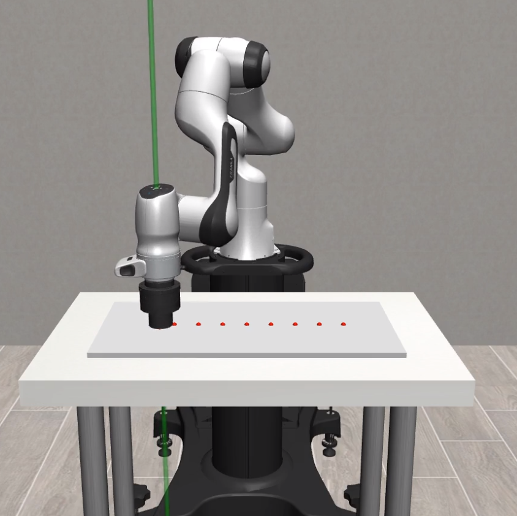
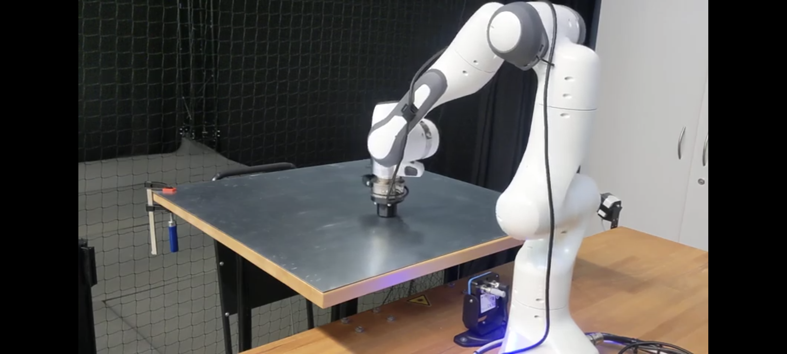
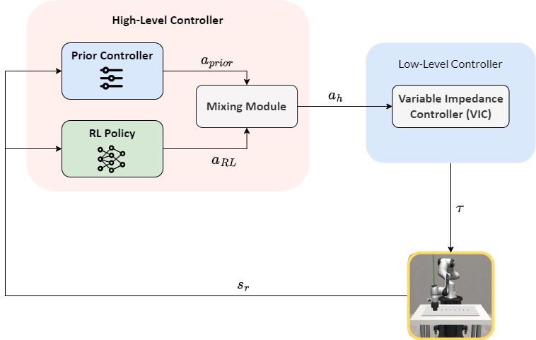

# Achieving Compliant Motion Control for Continuous-Contact Tasks with Reinforcement Learning
<p>
<div style="text-align:center">
  
   
   
</p>

 
<div style="text-align:left">

## Overview

This repository contains the code-base for the master thesis titled **"Achieving Complaint Motion by Combining RL with Cartesian Impedance Controller"**. 
This research project was conducted at the [Institute of Data Science in Mechanical Engineering](https://www.dsme.rwth-aachen.de/go/id/ibtrg/), RWTH Aachen University between June and December 2023.

The project aims to investigate methods for overcoming limitations of Reinforcement Learning (RL) in solving modern manufacturing tasks. We study different approaches which allow RL agents to leverage prior system knowledge through classical controllers. In particular, we analyse the distribution of agency between traditional control and RL agent to best solve the contact-rich task of robotic polishing. 

To this end, this thesis conducts an investigation into the combination of
RL and a prior controller to learn the gains and trajectory commands for a **variable
impedance controller (VIC)**. The following three hybrid approaches are compared against an optimal VIC and a standalone RL agent: 
* residual RL 
* split RL 
* curriculum RL. 

The **<span style="color:brown;">residual RL** approach involves the RL agent learning
an additive term on the prior controller. In contrast, the **<span style="color:brown;">split RL** approach splits the
agency such that the RL agent learns the impedance gains, and the base controller
provides the end-effector position commands. Lastly, the **<span style="color:brown;">curriculum RL** approach
features a time-based decay of the base controller’s contribution, such that, eventually, the final policy is entirely composed of the RL agent’s actions. 

The hybrid approaches are evaluated in a **simulated wiping environment**, focusing on training
task performance as well as the zero-shot generalization. The residual RL and split
RL configurations exhibit superior performance, excelling in **training safety, sample efficiency,** and **zero-shot adaptability**. 

This study validates the benefits of combining RL and control with a simulated robotic wiping task, and proposes designing hybrid
RL policies that preserve the robust actions from the prior controller for real-world
applications.

## Infrastructure

The task environment consists of a simplified polishing task with a 7-DOF Franka Emika Panda robot, where the robot is required to polish along a set of via-points, maintaining a desired force profile.


The project is based on the [robosuite](https://robosuite.ai/) simulation framework powered by the [MuJoCo](http://mujoco.org/) physics engine. The RL training is done with a [Soft Actor-Critic](https://arxiv.org/abs/1801.01290) policy using the modules from [Stable Baselines3](https://stable-baselines3.readthedocs.io/en/master/).
Configurations are managed using [hydra](https://hydra.cc/) and the experiments are logged using [wandb](https://wandb.ai/).

## Repository Structure

**Components built on top of robosuite [[Documentations]](https://robosuite.ai/docs/overview.html) are as follows:**
- `robosuite/environments/polishing.py`: The custom environment for the polishing task
- `robosuite/controllers/osc.py`: The custom impedance controller
- `robosuite/models/grippers/custom_gripper.py`: The custom compliant gripper model
- `robosuite/models/robots/manipulaotrs/panda_robot.py`: The robot model with task specific initializaition
- `robosuite/models/assets/objects/flat_top.xml`: The object model for the polishing task with via points
- `robosuite/main/config/`: The configuration folder following the [config schema](https://hydra.cc/docs/1.1/tutorials/structured_config/schema/) for the experiments
- `robosuite/wrappers/`: The folder consists of custom wrappers that interface the robosuite environments for RL. The `__init__`.py file lists the registered wrapper classes: Standalonewrapper, ResidualWrapper, SplitWrapper, and CurriculumWrapper 
- `robosuite/main/agent_eval.py`: The script to evaluate the trained agents

**Training and evaluation with Stable-Baselines3:**

NOTE: `stable-baselines3` is used as a [git submodule](https://git-scm.com/book/en/v2/Git-Tools-Submodules), i.e it is added as its own git respository within robosuite 
- `stable-baselines3/sac_hydra.py`: A common training script for all the RL agents
- `stable-baselines3/Callbacks/`: The folder consists of custom callbacks which help log task specific metrics during evaluation runs and safety triggers during training.
- `stable-baselines3/time_curriculum`: The folder consists of `get_tbc_algorithm` class which inherits the BaseAlgorithm class from stable_baselines3 and implements the time-based curriculum learning algorithm.
- `stable-baselines3/Residual_RL`: This folder consists of `Residual_SAC` class which inherits the SAC class from stable_baselines3 and implements the residual learning algorithm and adds the burn-in parameter
- `stable-baselines3/bash_scripts`: The folder consists of bash scripts to run the training of the different agent configurations on RWTH HPC.

## Installation and Use
- Clone the robosuite repository and checkout to branch `AP_Master_Thesis`
- Add stable-baselines3 as a submodule to the robosuite repository and checkout to its branch `AP_Master_Thesis`
- Install [miniconda on RWTH HPC](https://help.itc.rwth-aachen.de/en/service/rhr4fjjutttf/article/7230ed5050e94aacbbe1db14cada5b56/) 
- Create `robosuite` environment using the `robosuite/environment.yml`; The python version used is 3.8.16
- Ensure that your custom macros file or the `robsuite/macros.py` has MUJOCO_GPU_RENDERING set to False when running on RWTH HPC via remote tunnel from your system.

### Training, Evaluation and Baseline
- Use the bash scripts in `stable_baselines3/bash_scripts` to run the training on RWTH HPC and update the enviornment variables according to your setup.
- The hydra arguments for the training can be found from `robosuite/main/config/main.yml`
  - The alogorithm argument can be set to `sac` for the baseline SAC agent and `residual_sac`, `split_sac`, `curriculum_sac` for the hybrid agents.
  - For the residual configuration, the policy network parameters in `stable_baselines3/sac/policies.py` are to be initialized close to zero as hinted in the residual RL literature.  
  - `env`, `task_config` and `controller` are kept fixed for all the runs.
- `robosuite/main/hydra_sweep.py` is used to obtain the optimal fixed gain impedance controller baseline.
- `robosuite/main/agent_eval.py` is used to evaluate the trained agents.


## Citation
Please cite [**robosuite**](https://robosuite.ai) if you use this framework in your publications:
```bibtex
@inproceedings{robosuite2020,
  title={robosuite: A Modular Simulation Framework and Benchmark for Robot Learning},
  author={Yuke Zhu and Josiah Wong and Ajay Mandlekar and Roberto Mart\'{i}n-Mart\'{i}n and Abhishek Joshi and Soroush Nasiriany and Yifeng Zhu},
  booktitle={arXiv preprint arXiv:2009.12293},
  year={2020}
}
```
